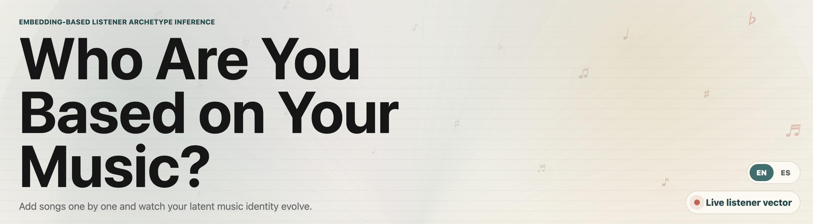
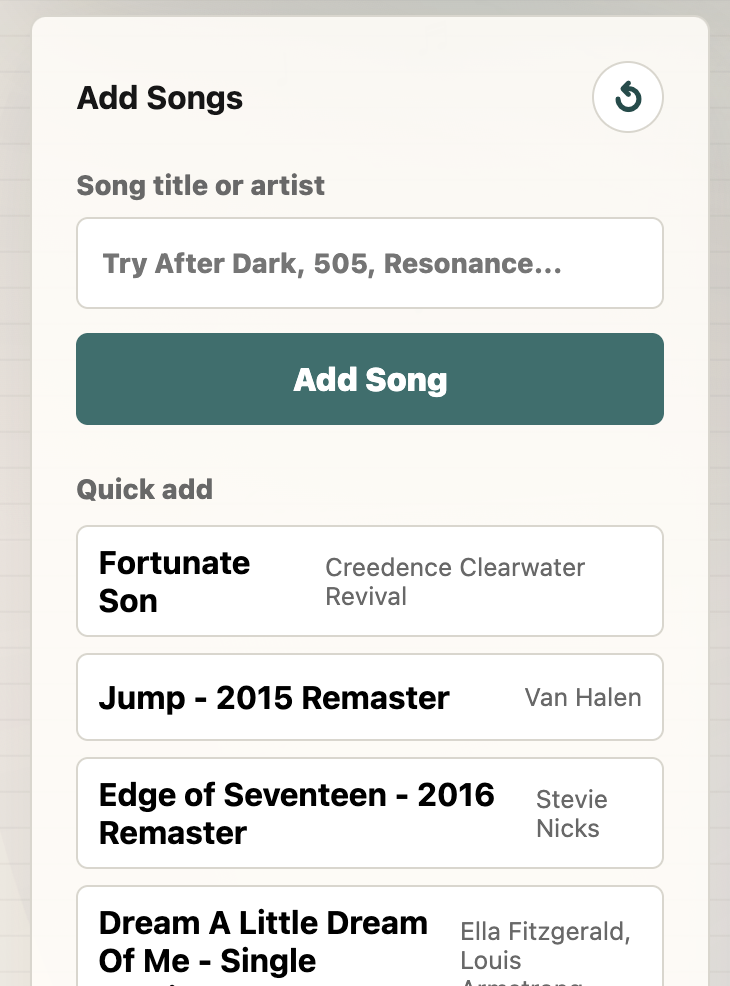
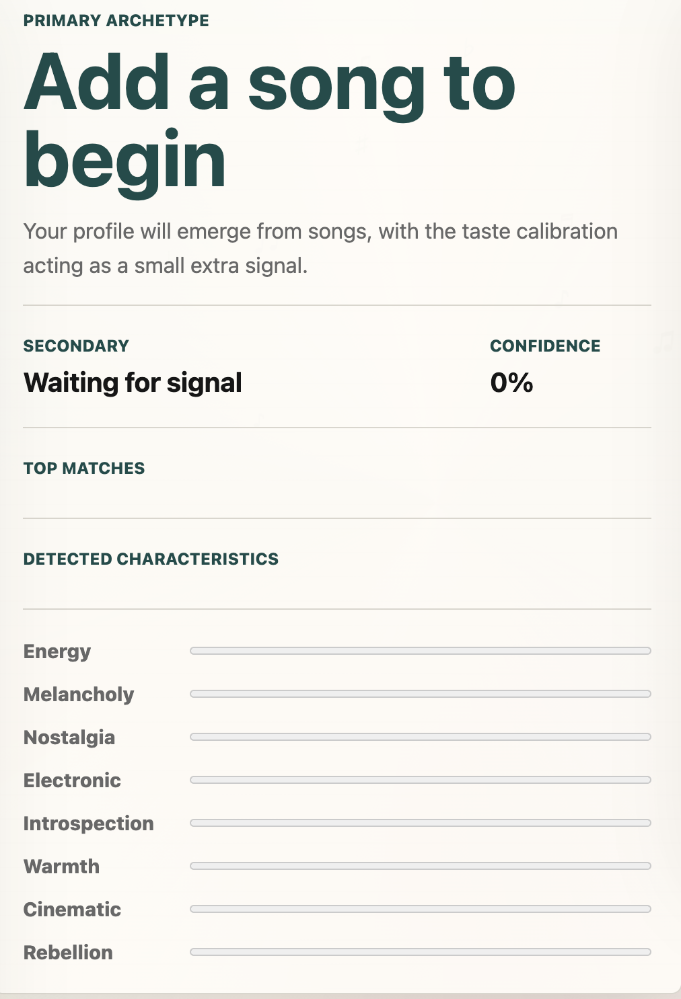
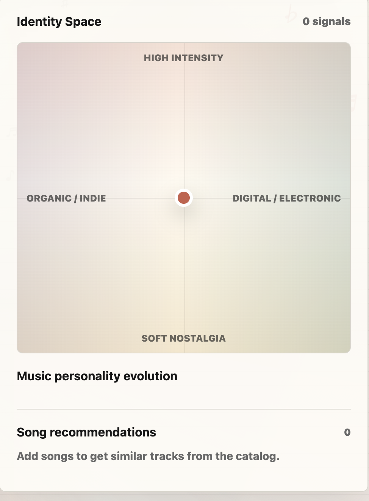
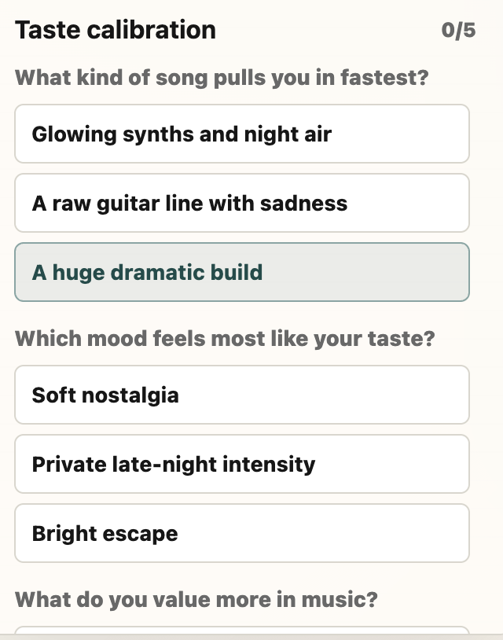
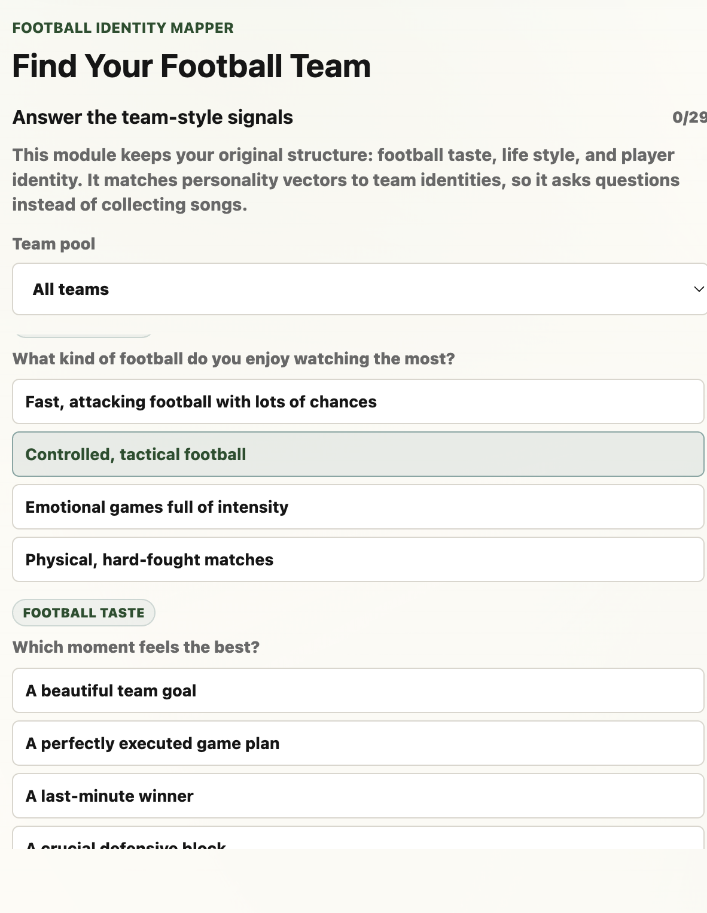

# Identity Mapper

Identity Mapper is a recommender-style identity checker. Instead of only recommending content, it recommends an identity match based on the things a user likes.

The app currently combines two modules:

- **Music**: add songs and get a listener archetype based on your taste.
- **Football**: answer questions and get a football team identity match.

Future modules are planned for:

- **YouTubers**: creator taste and content-style identity.
- **Stardew Valley**: character matching based on personality and play style.

## Live Demo

Try the app on Hugging Face:

[Identity Mapper demo](https://huggingface.co/spaces/Jovaz/identity-mapper)

## What The App Does

Identity Mapper turns preferences into a profile vector. Each module uses a different kind of input:

- Songs create a music taste profile.
- Football answers create a team-style profile.
- Future modules will use similar preference signals for creators and characters.

The result is saved into a small identity map, so the user can build a combined profile across different parts of their taste.

## Current Features

- Interactive custom HTML interface.
- Music listener archetype checker.
- Searchable song catalog.
- Song recommendations based on similarity.
- Football team matcher.
- Football team pools, including LaLiga, Premier League, Bundesliga, national teams, and Inazuma Eleven.
- Team badges for football results.
- English and Spanish interface toggle.
- Saved identity summary across modules.
- Animated visual backgrounds for each section.

## Screenshots

### Music Identity

The music module starts with a large listener-identity view and animated music background.



Users can switch between the available identity modules from the shared module selector.


Songs can be typed manually or selected from the quick-add list.



The result panel shows the current archetype, confidence, top matches, and trait signals.



The identity space visualizes the listener profile and includes song recommendations.



The taste calibration questions add extra preference signals to the music profile.



### Football Identity

The football module uses questions and team pools to match the user with a football identity.



## How To Use

Usage instructions will be added here.

<!--
Suggested structure:

1. Open the app.
2. Choose a module.
3. Add songs or answer questions.
4. View your identity result.
5. Switch modules to build your full identity map.
-->

## Run Locally

Install the dependencies:

```bash
pip install -r requirements.txt
```

Start the app:

```bash
python app.py
```

Then open:

```text
http://127.0.0.1:7860
```

For a quick visual preview without the Python API, you can also open `index.html` directly in a browser.

## Project Structure

```text
index.html              Main app interface
styles.css              Visual design and animations
app.js                  Frontend logic
app.py                  App entry point
api_server.py           Local prediction API
data/                   Song catalog and processed data
models/                 Trained music models
assets/badges/          Football team badges
scripts/                Data processing and publishing scripts
```

## Roadmap

- Add the YouTuber identity module.
- Add the Stardew Valley character module.
- Improve the music recommender results.
- Improve the vector system so early choices do not overweight the final position compared with later answers.
- Improve the music identity model so profiles do not get stuck too easily under the same archetype label.
- Improve the vector-space visualization and movement so profile changes feel clearer and more meaningful.
- Add a system that exports or retrieves a CSV file with user inputs, so the data can be reviewed and used to improve future accuracy.
- Complete missing football team badges.
- Add more visual identity summaries.
- Make the saved identity profile more complete.

## Links

- Live demo: [https://huggingface.co/spaces/Jovaz/identity-mapper](https://huggingface.co/spaces/Jovaz/identity-mapper)
- GitHub repository: [https://github.com/Joel-Vazquez-Lopez/identity-mapper](https://github.com/Joel-Vazquez-Lopez/identity-mapper)
